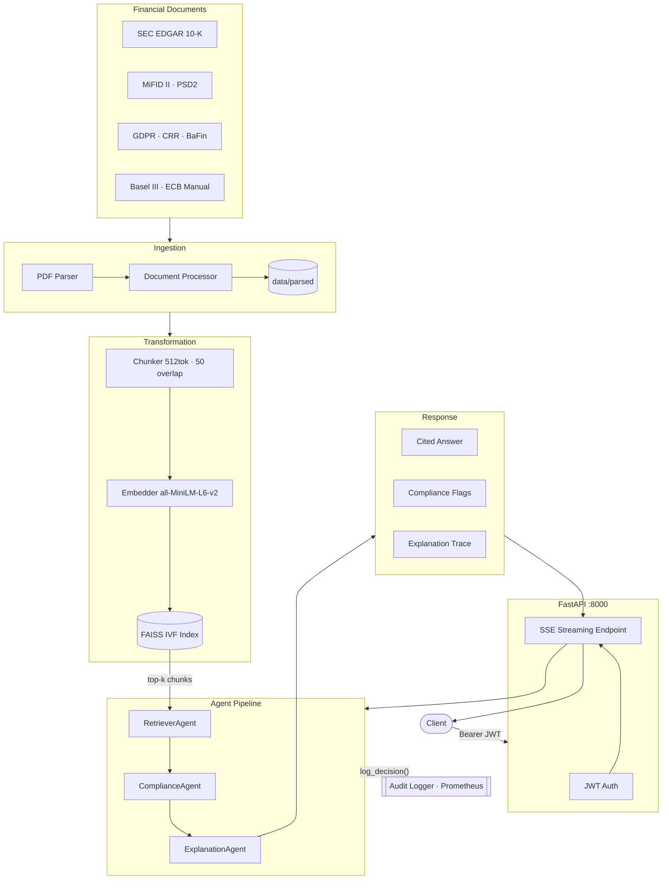

# Explainable LLM Agent for Financial Document Intelligence

An AI system that ingests regulatory and financial PDFs, answers compliance questions, and produces fully traceable, cited explanations — built for risk and compliance teams who need auditability alongside accuracy.



<details>
<summary><strong>▶ Project Demo — click to expand</strong></summary>
<br>

The demo below animates the full pipeline end-to-end across three real regulatory queries. It runs in your browser with no setup required.

**[→ Open Live Demo](https://asmitabhat30.github.io/Explainable-LLM-Agent-for-Financial-Document-Intelligence/demo/)**

What the demo shows (~60 second loop):

| Query | Regulation | Outcome |
|---|---|---|
| Minimum capital requirements for commercial banks | Basel III · CRR | Cited answer, no review flag |
| Does GDPR's right to erasure apply to transaction records? | GDPR · PSD2 · BaFin | Cited answer + `requires_review: true` |
| Position limits for commodity derivatives | MiFID II · CRR | Cited answer, no review flag |

Each query animates the full agent pipeline in real time:
- **RetrieverAgent** — FAISS vector search, top-k chunk retrieval with similarity scores
- **ComplianceAgent** — regulation matching, `requires_review` flag evaluation
- **ExplanationAgent** — streamed cited answer with source attribution
- **Audit log** — live `log_decision()` trace on the right panel

> Source: [`demo/index.html`](demo/index.html)

</details>

---

## Overview

Financial compliance teams routinely navigate dense regulatory frameworks — SEC filings, MiFID II, GDPR, Basel III, and more — where a missed clause or misattributed answer can carry significant legal and operational risk. This system addresses that challenge by combining Retrieval-Augmented Generation (RAG) with a structured multi-agent pipeline that not only answers questions but explains *why* each answer is correct, with direct citations to the source document.

Every decision made by the agent pipeline is logged for audit, and high-risk regulatory domains (such as GDPR and personal data topics) automatically surface a `requires_review` flag to prompt human oversight.

---

## System Architecture

The pipeline moves through four stages: document ingestion, semantic indexing, agent reasoning, and API delivery.



### Stage 1 — Ingestion
Raw PDFs from eight regulatory domains are parsed and normalised into structured documents. The parser handles varied PDF layouts and extracts metadata (source, regulation type, section) alongside the text content, storing clean output in `data/parsed/`.

### Stage 2 — Transformation & Indexing
Documents are split into 512-token chunks with a 50-token overlap to preserve context at boundaries. Each chunk is embedded using `sentence-transformers/all-MiniLM-L6-v2` and stored in a FAISS IVF index optimised for fast approximate nearest-neighbour search at scale.

### Stage 3 — Agent Pipeline
Incoming queries pass through three specialised agents in sequence:

| Agent | Responsibility |
|---|---|
| **RetrieverAgent** | Queries the FAISS index and returns the top-k most semantically relevant chunks |
| **ComplianceAgent** | Analyses retrieved context against the query, identifies applicable regulations, and sets `requires_review` where appropriate |
| **ExplanationAgent** | Synthesises a final answer grounded in the retrieved evidence, with inline citations and a full reasoning trace |

Each agent calls `log_decision()` at every significant step, producing a complete audit trail persisted to the audit logger.

### Stage 4 — API & Delivery
A FastAPI server (port 8000) exposes the pipeline behind JWT authentication. Responses are streamed to the client via Server-Sent Events (SSE), so answers appear progressively rather than after a full round-trip.

---

## Key Properties

- **Traceability** — every answer includes the source document, section, and chunk that supports it. No black-box outputs.
- **Audit trail** — all agent decisions are logged with hashed query identifiers; raw query text is never written to logs to protect PII.
- **Compliance flags** — GDPR, personal data, and other high-sensitivity topics trigger `requires_review: true` in the response, signalling that a human should verify before acting.
- **Resumable evaluation** — the evaluation harness checkpoints after each test case, so a run interrupted by a rate limit or quota error picks up exactly where it left off.

---

## Regulatory Domains Covered

SEC EDGAR 10-K · MiFID II · PSD2 · GDPR · CRR · BaFin · Basel III · ECB Supervisory Manual

---

## Quick Start

```bash
# Install dependencies
pip install -r requirements.txt

# Configure environment
cp .env.example .env   # then fill in OPENAI_API_KEY and JWT_SECRET_KEY

# Ingest documents
python ingestion/process_documents.py

# Build the FAISS index
python transformation/embed_all_documents.py

# Start the API
uvicorn api.main:app --reload --port 8000

# Run evaluation
python scripts/run_evaluation.py
```

---

## Tech Stack

| Layer | Technology |
|---|---|
| Embeddings | `sentence-transformers` · `all-MiniLM-L6-v2` |
| Vector index | FAISS (IVF) |
| LLM integration | OpenAI API via LangChain |
| API | FastAPI · SSE streaming |
| Auth | JWT · BCrypt |
| Validation | Pydantic v2 · Pandera |
| Monitoring | Prometheus · audit logger |
| Testing | pytest · pytest-cov |
| Data versioning | DVC |
